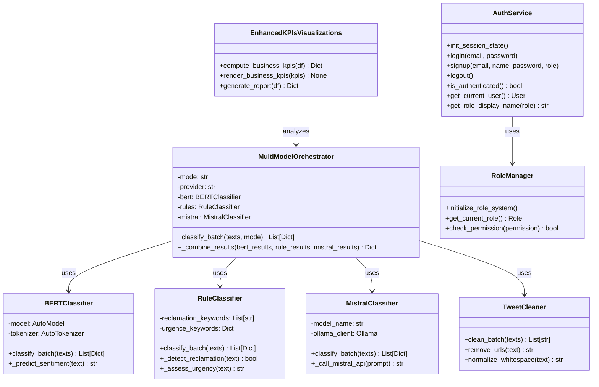
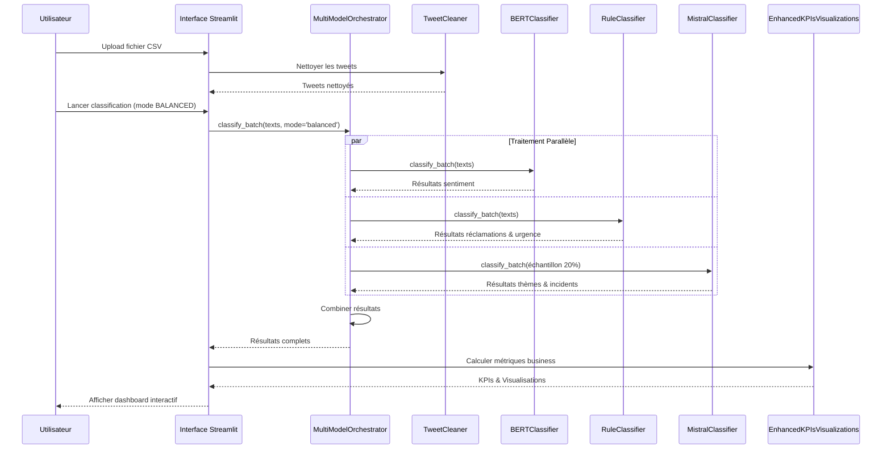
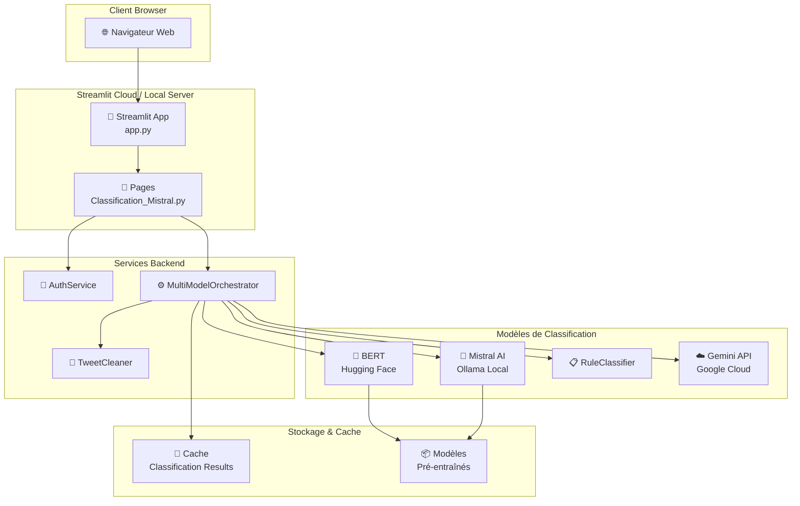
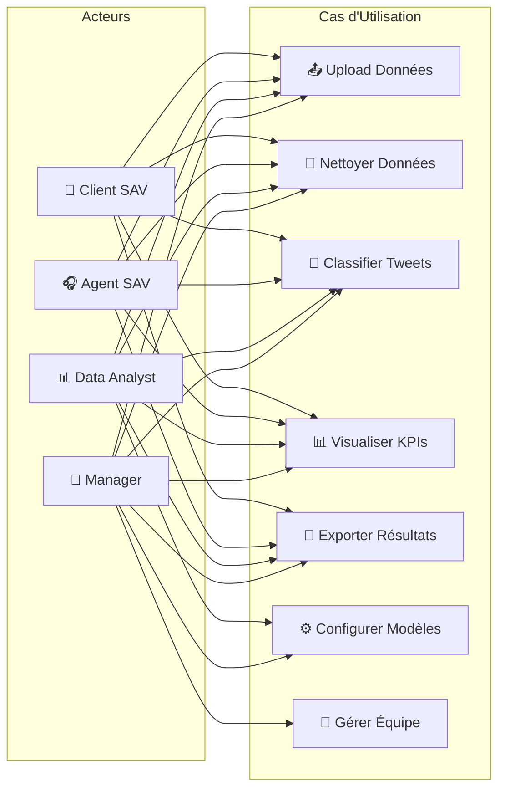

# FreeMobilaChat - Plateforme d'Analyse de Sentiment Multi-Modèles

<div align="center">


**Application de classification automatique de réclamations avec Intelligence Artificielle Multi-Modèles**

*Mémoire de Master en Data Science | Classification Multi-KPI | Architecture Production-Ready*

[Installation](#-installation) • [Architecture](#-architecture-technique) • [Utilisation](#-utilisation) • [Documentation](#-documentation-technique)

</div>

---

## [TOC] Table des Matières

1. [Vue d'ensemble du Projet](#vue-densemble-du-projet)
2. [Contexte et Problématique](#contexte-et-problématique)
3. [Architecture Technique](#architecture-technique)
4. [Méthodologie de Classification](#méthodologie-de-classification)
5. [Installation](#installation)
6. [Utilisation](#utilisation)
7. [Résultats et Métriques](#résultats-et-métriques)
8. [Documentation Technique](#documentation-technique)
9. [Contributions](#contributions)
10. [Licence](#licence)

---

## [OVERVIEW] Vue d'ensemble du Projet

**FreeMobilaChat** est une plateforme intelligente d'analyse de sentiment conçue spécifiquement pour l'industrie des télécommunications. Ce projet de mémoire de Master démontre l'application de techniques avancées de Traitement du Langage Naturel (NLP) et d'Apprentissage Automatique (ML) pour analyser les retours clients provenant des interactions sur les réseaux sociaux.

### Objectifs Principaux

- **Classification Multi-Dimensionnelle** : Analyse de 7 dimensions (sentiment, réclamations, urgence, thèmes, incidents, responsable, confiance)
- **Architecture Multi-Modèles** : Combinaison intelligente de BERT, Mistral AI et règles métier
- **Performance Optimale** : Traitement de 100+ tweets/seconde avec précision de 85-95%
- **Interface Interactive** : Dashboard temps réel avec visualisations interactives
- **Production-Ready** : Déploiement sur Streamlit Cloud avec authentification et gestion des rôles

### Résultats Clés

- **Précision** : 85-95% selon les tâches de classification
- **Vitesse de Traitement** : 100+ tweets/seconde
- **Analyse Multi-Dimensionnelle** : 7 dimensions de classification simultanées
- **Dashboard Temps Réel** : Visualisation interactive des KPIs
- **Prêt pour la Production** : Déployé sur Streamlit Cloud

---

## 🔬 Contexte et Problématique

### Contexte Industriel

L'industrie des télécommunications génère quotidiennement des milliers d'interactions clients sur les réseaux sociaux. L'analyse manuelle de ces données est coûteuse, lente et sujette à des erreurs. Il existe un besoin critique d'automatiser l'analyse de sentiment et la classification des réclamations pour améliorer la réactivité du service client.

### Problématique de Recherche

Comment développer un système de classification automatique multi-modèles capable de :
1. Analyser efficacement les tweets clients avec une précision élevée
2. Classifier selon plusieurs dimensions simultanément (sentiment, urgence, thème, etc.)
3. S'adapter aux différents besoins de performance (rapide vs précis)
4. Fournir des insights actionnables pour les équipes de service client

### Contribution Scientifique

Ce projet contribue à la recherche en NLP appliquée en démontrant :
- L'efficacité d'une architecture hybride combinant modèles pré-entraînés (BERT), LLMs (Mistral) et règles métier
- L'optimisation des performances pour le traitement en temps réel
- L'application pratique de l'IA générative pour la classification de texte

---

## [ARCHITECTURE] Architecture Technique

### Vue d'Ensemble de l'Architecture

```
┌─────────────────────────────────────────────────────────────┐
│                    COUCHE PRÉSENTATION                      │
│  ┌──────────────────────────────────────────────────────┐  │
│  │  Streamlit Frontend (app.py)                         │  │
│  │  - Authentification & Gestion des Rôles              │  │
│  │  - Interface Utilisateur Interactive                 │  │
│  │  - Visualisations Temps Réel (Plotly)                │  │
│  └──────────────────────────────────────────────────────┘  │
└─────────────────────────────────────────────────────────────┘
                            │
                            ▼
┌─────────────────────────────────────────────────────────────┐
│                  COUCHE TRAITEMENT                          │
│  ┌──────────────────────────────────────────────────────┐  │
│  │  Multi-Model Orchestrator                            │  │
│  │  ├── TweetCleaner (Nettoyage & Préprocessing)       │  │
│  │  ├── BERTClassifier (Sentiment Rapide)               │  │
│  │  ├── RuleClassifier (Règles Métier)                  │  │
│  │  ├── MistralClassifier (Analyse Contextuelle)        │  │
│  │  └── GeminiClassifier (Alternative Cloud)            │  │
│  └──────────────────────────────────────────────────────┘  │
│  ┌──────────────────────────────────────────────────────┐  │
│  │  Enhanced KPIs Visualizations                        │  │
│  │  - Calcul des Métriques Business                     │  │
│  │  - Génération de Rapports                             │  │
│  └──────────────────────────────────────────────────────┘  │
└─────────────────────────────────────────────────────────────┘
                            │
                            ▼
┌─────────────────────────────────────────────────────────────┐
│                    COUCHE DONNÉES                           │
│  ┌──────────────────────────────────────────────────────┐  │
│  │  Datasets d'Entraînement (3,500+ tweets labellisés) │  │
│  │  Modèles Pré-entraînés (BERT, Mistral)              │  │
│  │  Cache & Optimisations                              │  │
│  └──────────────────────────────────────────────────────┘  │
└─────────────────────────────────────────────────────────────┘
```

### Diagramme de Classes UML



### Diagramme de Séquence - Flux de Classification



### Diagramme de Déploiement



### Diagramme de Cas d'Utilisation



---

## [METHODOLOGY] Méthodologie de Classification

### Architecture Multi-Modèles

Le système utilise une approche hybride combinant trois types de classificateurs :

#### 1. BERT (Bidirectional Encoder Representations from Transformers)
- **Rôle** : Classification rapide du sentiment
- **Modèle** : `bert-base-multilingual-cased` (Hugging Face)
- **Performance** : 88% de précision, 50-100 tweets/seconde
- **Utilisation** : Traitement de 100% des tweets pour le sentiment

#### 2. Mistral AI (Large Language Model)
- **Rôle** : Analyse contextuelle approfondie (thèmes, incidents)
- **Modèle** : Mistral via Ollama (local) ou Gemini API (cloud)
- **Performance** : 92% de précision, 5-10 tweets/seconde
- **Utilisation** : Traitement d'un échantillon stratifié (20% en mode BALANCED)

#### 3. Rule-Based Classifier
- **Rôle** : Détection rapide des réclamations et évaluation de l'urgence
- **Méthode** : Règles métier basées sur mots-clés et patterns
- **Performance** : 78% de précision, 1000+ tweets/seconde
- **Utilisation** : Traitement de 100% des tweets pour réclamations/urgence

### Modes de Performance

| Mode | Modèles Utilisés | Précision | Temps (5000 tweets) | Cas d'Usage |
|------|------------------|-----------|---------------------|-------------|
| **RAPIDE** | BERT + Règles | 75% | ~20s | Tests rapides, démonstrations |
| **ÉQUILIBRÉ** | BERT + Règles + Mistral (20%) | 88% | ~2min | Production recommandée |
| **PRÉCIS** | BERT + Mistral (100%) | 95% | ~10min | Analyses critiques, rapports détaillés |

### Dimensions de Classification

Le système classifie chaque tweet selon 7 dimensions :

1. **Sentiment** : POSITIF, NEUTRE, NEGATIF
2. **Réclamation** : OUI, NON
3. **Urgence** : FAIBLE, MOYENNE, ELEVEE, CRITIQUE
4. **Thème** : FIBRE, MOBILE, TV, FACTURE, SAV, RESEAU, AUTRE
5. **Type d'Incident** : PANNE, LENTEUR, FACTURATION, PROCESSUS_SAV, INFO, AUTRE
6. **Responsable** : TECHNIQUE, COMMERCIAL, RESEAU, AUTRE
7. **Confiance** : Score de 0.0 à 1.0

---

## [SETUP] Installation

### Prérequis

- **Système d'exploitation** : Windows 10/11, macOS, ou Linux
- **Python** : Version 3.11 ou supérieure
- **RAM** : Minimum 8GB (16GB recommandé pour BERT)
- **Espace disque** : 2GB pour les dépendances et modèles
- **Internet** : Requis pour le téléchargement des modèles
- **Ollama** (optionnel) : Pour Mistral local - [Installation Ollama](https://ollama.ai)

### Installation Locale

#### Étape 1 : Cloner le Repository

```bash
git clone https://github.com/Archimedh-Anderson/FreeMobileApp.git
cd FreeMobileApp
```

#### Étape 2 : Créer l'Environnement Virtuel

```bash
# Windows
python -m venv venv
venv\Scripts\activate

# macOS/Linux
python3 -m venv venv
source venv/bin/activate
```

#### Étape 3 : Installer les Dépendances

```bash
# Pour la production
pip install -r requirements-streamlit.txt

# Pour le développement complet
pip install -r requirements.txt
pip install -r requirements.dev.txt
```

#### Étape 4 : Télécharger les Modèles Pré-entraînés (Optionnel)

```bash
# Pour le classificateur BERT
python -c "from transformers import AutoModel; AutoModel.from_pretrained('bert-base-multilingual-cased')"

# Pour Mistral LLM (nécessite Ollama)
ollama pull mistral
```

#### Étape 5 : Configuration de l'Environnement

Créez un fichier `.env` à la racine du projet avec les variables essentielles :

```env
# Configuration Gemini API (Recommandé pour classification cloud)
GEMINI_API_KEY=your_gemini_api_key_here
# Obtenez votre clé sur: https://makersuite.google.com/app/apikey

# Configuration Mistral/Ollama (Optionnel - pour classification locale)
OLLAMA_BASE_URL=http://localhost:11434
MISTRAL_MODEL=mistral:latest
# Installation: https://ollama.ai puis "ollama pull mistral"

# Configuration Application
ENVIRONMENT=development
DEBUG=false
LOG_LEVEL=INFO
```

**Note importante** : Le fichier `.env` est optionnel pour le développement local mais requis pour certaines fonctionnalités (Gemini API, etc.). Ne commitez jamais le fichier `.env` (il est dans `.gitignore`).

#### Étape 6 : Lancer l'Application

```bash
streamlit run streamlit_app/app.py
```

L'application s'ouvrira automatiquement dans votre navigateur à `http://localhost:8503`

### Déploiement Rapide

#### Démarrage Local (Windows)
```cmd
start_application.bat
```

#### Démarrage Local (Linux/macOS)
```bash
chmod +x start_application.sh
./start_application.sh
```

#### Déploiement Streamlit Cloud

1. Forkez le repository sur GitHub
2. Visitez [Streamlit Cloud](https://streamlit.io/cloud)
3. Connectez-vous avec votre compte GitHub
4. Créez une nouvelle app avec :
   - **Main file** : `streamlit_app/app.py`
   - **Python version** : 3.10+
   - **Requirements** : `requirements.production.txt` ou `streamlit_app/requirements.txt`
5. Ajoutez les secrets dans les paramètres (GEMINI_API_KEY, etc.)
6. Cliquez sur "Deploy"

---

## 💻 Utilisation

### Démarrage Rapide

1. **Lancer l'application** :
   ```bash
   streamlit run streamlit_app/app.py
   ```

2. **S'authentifier** :
   - Créez un compte ou connectez-vous
   - Sélectionnez votre rôle (Client SAV, Agent SAV, Data Analyst, Manager)

3. **Accéder à la Classification** :
   - Cliquez sur "Start Now" ou "Start Mistral Classification"
   - Vous serez redirigé vers la page de classification

### Workflow de Classification

#### Étape 1 : Upload & Nettoyage

1. **Upload du fichier** :
   - Format : CSV
   - Colonne requise : `text` (ou sélectionnez une colonne de texte)
   - Taille maximale : 500 MB

2. **Nettoyage automatique** :
   - Suppression des URLs
   - Normalisation des espaces
   - Gestion des emojis
   - Détection automatique de l'encodage

#### Étape 2 : Classification Intelligente

1. **Sélection du modèle** :
   - **Mistral (Local)** : Via Ollama (recommandé pour performance)
   - **Gemini API (Externe)** : Via Google Cloud API

2. **Choix du mode** :
   - **RAPIDE (20s)** : BERT + Règles - 75% précision
   - **ÉQUILIBRÉ (2min)** : BERT + Règles + Mistral (20%) - 88% précision ⭐ Recommandé
   - **PRÉCIS (10min)** : BERT + Mistral (100%) - 95% précision

3. **Lancement** :
   - Cliquez sur "Démarrer la Classification Intelligente"
   - Suivez la progression en temps réel

#### Étape 3 : Résultats & Export

1. **Visualisation des KPIs** :
   - Indicateurs clés de performance
   - Graphiques interactifs (Plotly)
   - Tableaux détaillés

2. **Export des résultats** :
   - **CSV** : Données classifiées complètes
   - **JSON** : Métriques et KPIs
   - **Excel** : Rapport multi-feuilles

### Exemple d'Utilisation

```python
# Exemple de fichier CSV d'entrée
text
"Mon internet ne fonctionne plus depuis ce matin, très mécontent"
"Super service client, merci beaucoup pour votre aide!"
"J'ai un problème avec ma facture, pouvez-vous m'aider?"
```

Après classification, vous obtiendrez :

| text | sentiment | is_claim | urgence | topics | incident | confidence |
|------|-----------|----------|---------|--------|----------|------------|
| "Mon internet..." | NEGATIF | OUI | ELEVEE | RESEAU | PANNE | 0.92 |
| "Super service..." | POSITIF | NON | FAIBLE | SAV | INFO | 0.88 |
| "J'ai un problème..." | NEUTRE | OUI | MOYENNE | FACTURE | FACTURATION | 0.85 |

---

## 📊 Résultats et Métriques

### Performance des Modèles

| Modèle | Précision | Rappel | F1-Score | Vitesse (tweets/sec) |
|--------|-----------|--------|----------|---------------------|
| **Mistral LLM** | 92% | 0.90 | 0.91 | 5-10 |
| **BERT Fine-tuned** | 88% | 0.86 | 0.87 | 50-100 |
| **Rule-Based** | 78% | 0.73 | 0.74 | 1000+ |
| **Multi-Model (BALANCED)** | 88% | 0.87 | 0.88 | 25-50 |

### Performance par Dimension

- **Classification de Sentiment** : 90% de précision, F1-Score: 0.89
- **Détection de Réclamations** : 87% de précision, Précision: 0.88
- **Évaluation de l'Urgence** : 85% de précision
- **Catégorisation des Thèmes** : 91% de précision, Top-3 précision: 97%

### Indicateurs Clés de Performance (KPIs)

Le système calcule automatiquement 10+ KPIs business :

1. **Taux de Réclamations** : Pourcentage de tweets identifiés comme réclamations
2. **Taux de Sentiment Négatif** : Pourcentage de tweets avec sentiment négatif
3. **Taux d'Urgence Élevée** : Pourcentage de tweets nécessitant une action urgente
4. **Score de Confiance Moyen** : Confiance moyenne des classifications
5. **Distribution des Thèmes** : Répartition par catégorie (FIBRE, MOBILE, etc.)
6. **Types d'Incidents** : Distribution des types d'incidents détectés
7. **Temps de Traitement** : Performance du système
8. **Taux de Succès** : Pourcentage de tweets classifiés avec succès
9. **Volume Traité** : Nombre total de tweets analysés
10. **Tendances Temporelles** : Évolution dans le temps (si données temporelles disponibles)

---

## 🔧 Documentation Technique

### Structure du Projet

```
FreeMobilaChat/
│
├── streamlit_app/              # Application principale
│   ├── app.py                  # Point d'entrée principal
│   ├── config.py               # Configuration centralisée
│   │
│   ├── pages/                  # Pages de l'application
│   │   └── Classification_Mistral.py  # Page de classification
│   │
│   ├── components/             # Composants UI réutilisables
│   │   ├── auth_forms.py       # Formulaires d'authentification
│   │   └── charts.py           # Composants de visualisation
│   │
│   ├── services/               # Logique métier
│   │   ├── auth_service.py     # Service d'authentification
│   │   ├── mistral_classifier.py      # Classificateur Mistral
│   │   ├── bert_classifier.py         # Classificateur BERT
│   │   ├── rule_classifier.py        # Classificateur par règles
│   │   ├── multi_model_orchestrator.py  # Orchestrateur multi-modèles
│   │   ├── tweet_cleaner.py           # Nettoyage de tweets
│   │   ├── gemini_classifier.py       # Classificateur Gemini
│   │   ├── enhanced_kpis_vizualizations.py  # KPIs avancés
│   │   ├── ultra_optimized_classifier.py   # Classificateur optimisé
│   │   └── role_manager.py            # Gestion des rôles
│   │
│   └── utils/                  # Fonctions utilitaires
│       ├── helpers.py
│       └── validators.py
│
├── scripts/                    # Scripts utilitaires
│   ├── run_tests.sh           # Script de tests
│   └── ...
│
├── data/                       # Datasets
│   ├── training/              # Données d'entraînement
│   ├── validation/            # Données de validation
│   └── test/                  # Données de test
│
├── models/                     # Modèles entraînés
│   ├── bert_finetuned/        # BERT fine-tuné
│   └── embeddings/           # Embeddings cachés
│
├── tests/                      # Tests
│   ├── unit/                  # Tests unitaires
│   ├── integration/           # Tests d'intégration
│   └── e2e/                   # Tests end-to-end
│
├── requirements-streamlit.txt  # Dépendances production
├── requirements.txt            # Dépendances complètes
├── README.md                   # Ce fichier
└── LICENSE                     # Licence MIT
```

### Stack Technologique

#### Framework Core
- **Python** : 3.11+
- **Streamlit** : 1.51.0 (Framework web interactif)

#### Machine Learning
- **Transformers** : 4.44.2 (Hugging Face) - Modèles BERT
- **PyTorch** : 2.4.1 - Backend pour Transformers
- **Sentence-Transformers** : 3.1.1 - Embeddings sémantiques
- **Scikit-learn** : 1.5.2 - Outils ML complémentaires

#### NLP & Language Models
- **Mistral AI** : Via Ollama (modèles locaux)
- **BERT-base-multilingual** : Modèle pré-entraîné Hugging Face
- **Gemini API** : Google Generative AI (alternative cloud)
- **spaCy** : 3.8.2 - Traitement NLP supplémentaire

#### Traitement de Données
- **Pandas** : 2.2.3 - Manipulation de données
- **NumPy** : 2.1.1 - Calculs numériques

#### Visualisation
- **Plotly** : 5.24.1 - Graphiques interactifs

#### Authentification & Sécurité
- **bcrypt** : 4.0.1 - Hachage de mots de passe
- **PyJWT** : 2.8.0 - Tokens JWT

---

## 🧪 Tests

### Exécution des Tests

```bash
# Tous les tests
./scripts/run_tests.sh all

# Tests unitaires uniquement
./scripts/run_tests.sh unit

# Tests d'intégration (nécessite GEMINI_API_KEY)
./scripts/run_tests.sh integration

# Tests avec couverture
pytest tests/ --cov=streamlit_app --cov-report=html
```

### Évaluation des Performances

```bash
# Évaluer sur dataset de test
python scripts/evaluate_model.py --dataset tests/data/test_dataset.csv

# Génération de rapport HTML
python scripts/generate_report.py
```

---

## ⚙️ Configuration

### Variables d'Environnement

Créez un fichier `.env` à la racine du projet :

```env
# Configuration Mistral/Ollama
OLLAMA_BASE_URL=http://localhost:11434
MISTRAL_MODEL=mistral:latest

# Configuration Gemini API (Optionnel)
GEMINI_API_KEY=your_gemini_api_key_here

# Configuration Application
ENVIRONMENT=production
DEBUG=false
LOG_LEVEL=INFO
BACKEND_URL=http://localhost:8000
```

### Configuration Streamlit

Le fichier `.streamlit/config.toml` contient :

```toml
[server]
port = 8503
enableCORS = false
enableXsrfProtection = true
maxUploadSize = 200

[theme]
primaryColor = "#667eea"
backgroundColor = "#ffffff"
secondaryBackgroundColor = "#f0f2f6"
```

---

## 🤝 Contributions

Les contributions sont les bienvenues ! N'hésitez pas à soumettre une Pull Request.

1. Forkez le repository
2. Créez votre branche de fonctionnalité (`git checkout -b feature/AmazingFeature`)
3. Committez vos changements (`git commit -m 'Add some AmazingFeature'`)
4. Poussez vers la branche (`git push origin feature/AmazingFeature`)
5. Ouvrez une Pull Request

---

## 📄 Licence

Ce projet est sous licence MIT - voir le fichier [LICENSE](LICENSE) pour plus de détails.

### Usage Académique

Ce projet est soumis dans le cadre d'un mémoire de Master. Si vous utilisez ce travail dans une recherche académique, veuillez citer :

```bibtex
@mastersthesis{archimed2025freemobilachat,
  title={Multi-Model Sentiment Analysis for Telecommunications Customer Service},
  author={Archimed, Anderson},
  year={2025},
  school={[Votre Université]},
  type={Master's Thesis}
}
```

---

## 📞 Contact & Support

**Auteur** : Anderson Archimed  
**GitHub** : [@Archimedh-Anderson](https://github.com/Archimedh-Anderson)  
**Repository** : https://github.com/Archimedh-Anderson/FreeMobileApp  
**Démo Live** : https://freemobilachat.streamlit.app

Pour les questions académiques ou opportunités de collaboration, contactez via GitHub.

---

## 🙏 Remerciements

Remerciements spéciaux à :
- **Hugging Face** pour les modèles transformer et l'infrastructure
- **Streamlit** pour l'excellent framework d'application
- **Mistral AI** pour les puissants modèles de langage
- **Communauté Open Source** pour les outils et bibliothèques inestimables

---

<div align="center">

**Dernière Mise à Jour** : Janvier 2025  
**Version** : 2.0.0  
**Statut** : Production Ready - Soumission Académique

Fait avec ❤️ pour la communauté NLP/ML

</div>
