# FreeMobilaChat - Architecture Complète

## Diagramme d'Architecture du Système

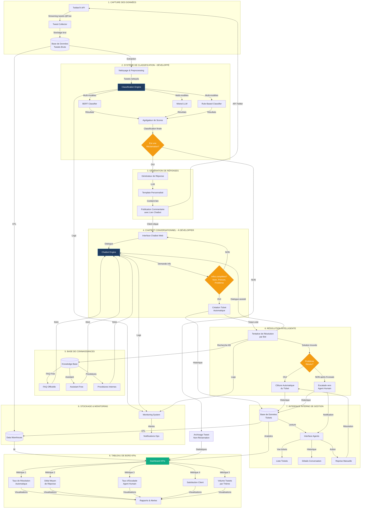

## Flux de Données Détaillé

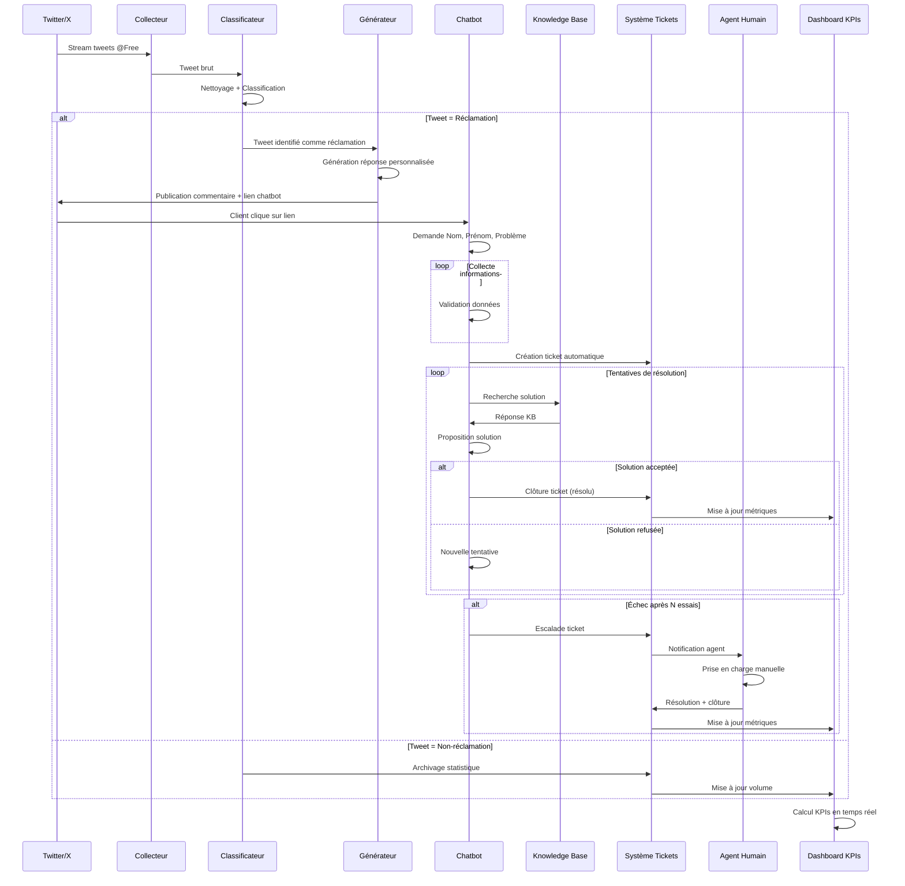

## Architecture Technique par Composant

```mermaid
graph TB
    subgraph "CURRENT DEPLOYMENT - Streamlit Cloud"
        direction TB
        SC[Streamlit Cloud Runtime]
        SC --> SC1[Python 3.10 Environment]
        SC --> SC2[Git Auto-Deploy]
        SC --> SC3[HTTPS/SSL Termination]
    end
    
    subgraph "APPLICATION LAYER"
        direction TB
        A1[Streamlit App]
        A1 --> A1a[Home.py]
        A1 --> A1b[Classification_Mistral.py]
        A1 --> A1c[Classification_Mistral.py]
    end
    
    subgraph "ML/AI PROCESSING"
        direction TB
        B1[BERT Classifier]
        B2[Mistral LLM]
        B3[Rule Engine]
        B4[Batch Processor]
        
        B1 --> B1a[CamemBERT-base]
        B2 --> B2a[Mistral-7B via API]
        B3 --> B3a[Regex Patterns]
        B4 --> B4a[Parallel Processing]
    end
    
    subgraph "DATA PROCESSING"
        direction TB
        D1[Tweet Cleaner]
        D2[Validators]
        D3[KPI Calculator]
        
        D1 --> D1a[Emoji Conversion]
        D1 --> D1b[URL Removal]
        D2 --> D2a[CSV Validation]
        D3 --> D3a[Metrics Aggregation]
    end
    
    subgraph "STORAGE - Academic Mode"
        direction TB
        S1[CSV Files]
        S2[Session State]
        S3[Cache]
        
        S1 --> S1a[Upload Storage]
        S2 --> S2a[In-Memory State]
        S3 --> S3a[LRU Cache]
    end
    
    subgraph "EXTERNAL APIs"
        direction TB
        E1[Hugging Face API]
        E2[Mistral API Optional]
        E3[GitHub Auto-Deploy]
    end
    
    A1 --> B1 & B2 & B3 & B4
    B1 & B2 & B3 --> D3
    A1 --> D1 & D2
    A1 --> S1 & S2 & S3
    B1 --> E1
    B2 -.->|Optional| E2
    SC2 --> E3
    
    style SC fill:#3498DB,stroke:#2980B9,color:#fff
    style A1 fill:#1E3A5F,stroke:#2E86DE,color:#fff
    style B1 fill:#E74C3C,stroke:#C0392B,color:#fff
    style B2 fill:#E74C3C,stroke:#C0392B,color:#fff
    style D3 fill:#10AC84,stroke:#0FB870,color:#fff
```

## Infrastructure Déploiement Production (Planifié)

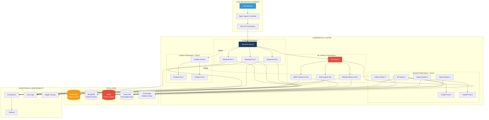

## Container Architecture (Docker)

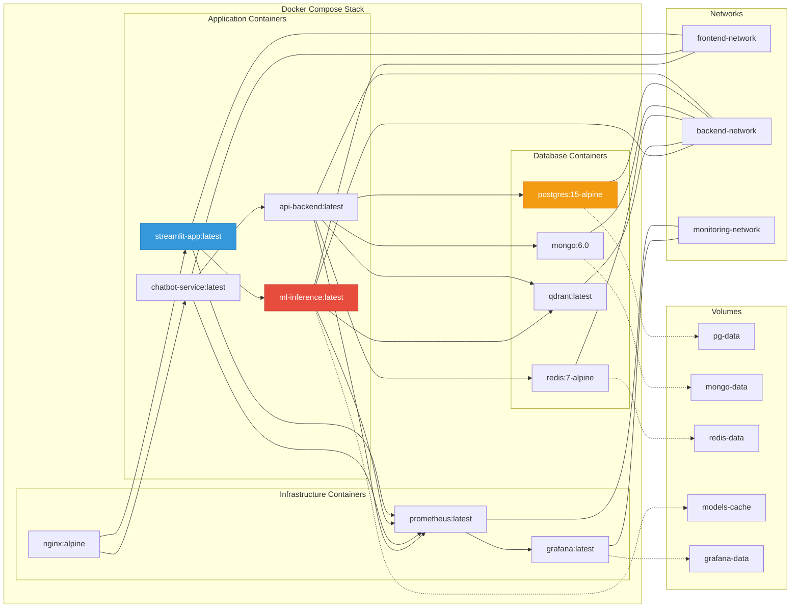

## Network Architecture

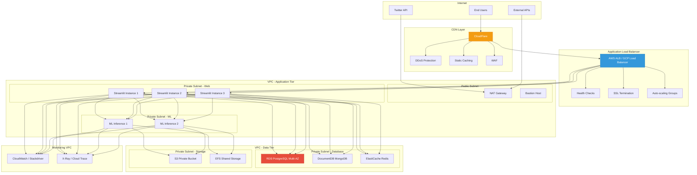

## Légende des Composants

### 🟦 Développé (Production Ready)
- **Système de Classification**: BERT + Mistral + Rules
- **Dashboard Streamlit**: Interface d'analyse et visualisation
- **Preprocessing Pipeline**: Nettoyage et normalisation des tweets
- **KPI Analytics**: Calcul et affichage des métriques

### 🟨 En Développement
- **Tweet Collector**: Capture automatique via Twitter API
- **Response Generator**: Génération de réponses personnalisées

### 🟥 À Développer
- **Chatbot Conversationnel**: Interface de dialogue client
- **Knowledge Base Integration**: Connexion FAQ/Assistant Free
- **Ticket Management System**: Création et suivi des tickets
- **Agent Interface**: Interface pour agents humains
- **Escalation Logic**: Logique de transfert automatique

## Métriques KPIs Principales

| KPI | Description | Objectif |
|-----|-------------|----------|
| **Taux de Classification** | % tweets correctement classifiés | > 90% |
| **Précision Réclamations** | Precision sur détection réclamations | > 85% |
| **Taux Résolution Auto** | % tickets résolus par bot | > 60% |
| **Délai Moyen Réponse** | Temps moyen première réponse | < 5 min |
| **Taux Escalade** | % tickets transmis agents | < 30% |
| **Satisfaction Client** | Score satisfaction post-résolution | > 4/5 |
| **Temps Résolution** | Durée moyenne clôture ticket | < 2h |

## Technologies Utilisées

### Current Stack (Academic/Production)
- **Application**: Streamlit 1.28.1 (Pure Python web framework)
- **ML Frameworks**: PyTorch 2.1.0, Transformers 4.35.0, Scikit-learn 1.3.1
- **Models**: CamemBERT-base, Mistral-7B (API)
- **Visualization**: Plotly 5.17.0, Pandas 2.1.1
- **Data Processing**: NumPy 1.25.2, Emoji 2.8.0
- **Testing**: Pytest 7.4.3, Pytest-cov 4.1.0
- **Deployment**: Streamlit Cloud (GitHub auto-deploy)
- **Storage**: CSV files (academic), Session State (runtime)
- **Version Control**: Git, GitHub, DVC 3.30.1

### Future Production Stack
- **Backend**: FastAPI 0.104.1, Celery, Uvicorn
- **Databases**: PostgreSQL 15 (tickets), MongoDB 6.0 (tweets), Redis 7 (cache/queue)
- **Vector DB**: Qdrant or Pinecone (knowledge base embeddings)
- **Container**: Docker, Docker Compose
- **Orchestration**: Kubernetes (K8s), Helm Charts
- **Cloud**: AWS (RDS, S3, ECS) or GCP (Cloud Run, GCS)
- **Monitoring**: Prometheus, Grafana, CloudWatch
- **Tracing**: Jaeger or AWS X-Ray
- **CI/CD**: GitHub Actions, ArgoCD
- **CDN**: CloudFlare
- **Load Balancer**: AWS ALB or GCP Load Balancer

## Current Deployment Architecture (Streamlit Cloud)

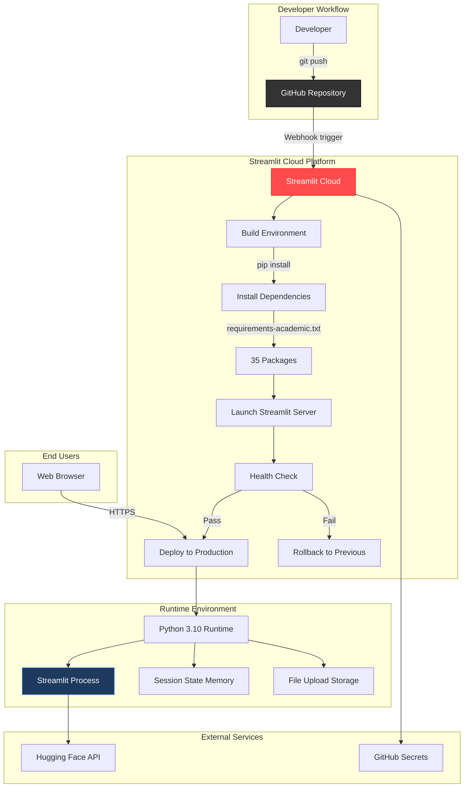

## CI/CD Pipeline (GitHub Actions)

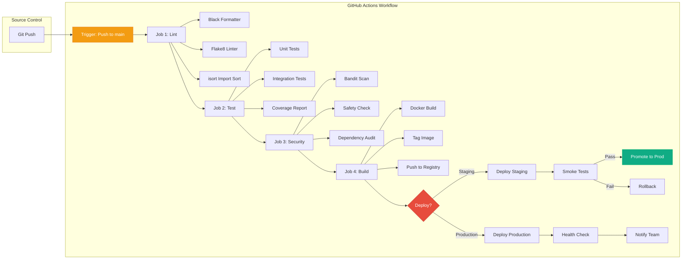

## Workflow de Déploiement

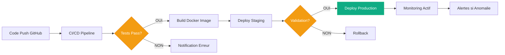

## Évolutivité et Performance

### Architecture Haute Disponibilité (HA)

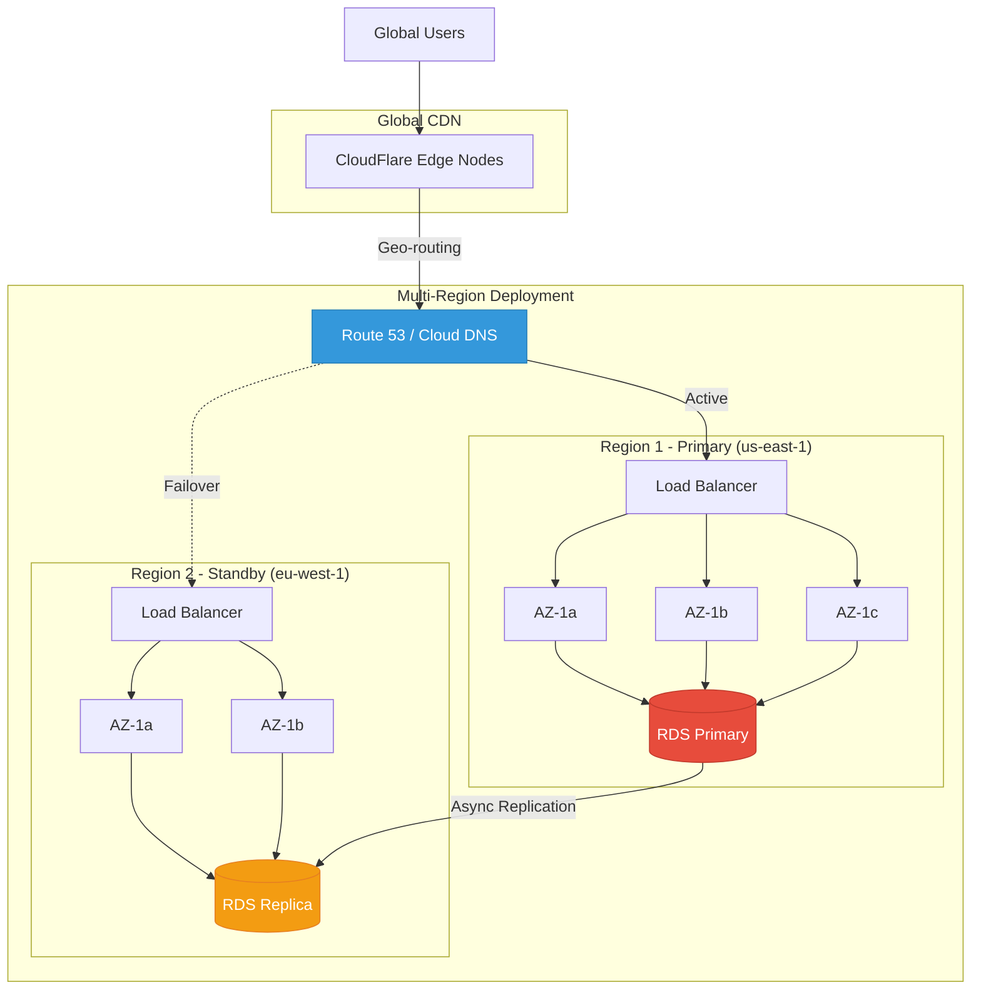

### Auto-Scaling Configuration

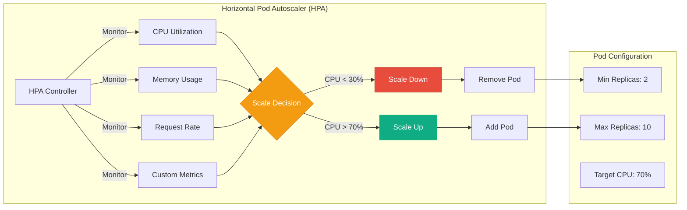

### Data Backup & Disaster Recovery

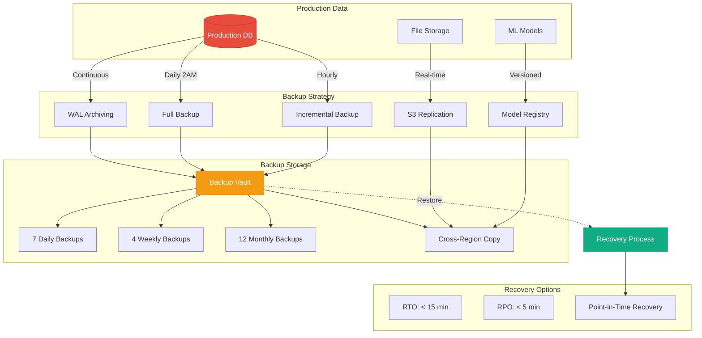

### Caching Strategy

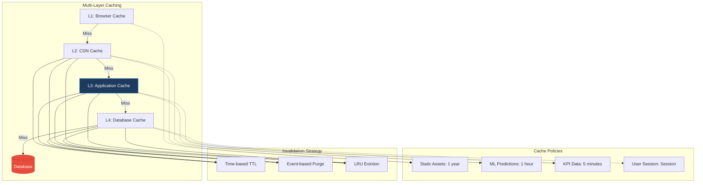

### Security Architecture

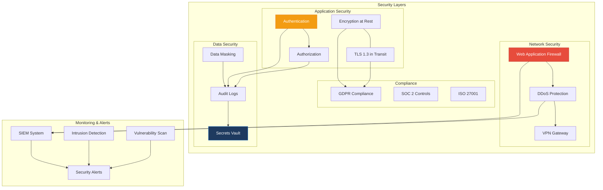

### Scalabilité Horizontale
- **Tweet Collector**: Multi-threading pour capture en temps réel (5000+ tweets/sec)
- **Classification**: Batch processing parallèle (200 tweets/sec par worker)
- **Chatbot**: Load balancing sur plusieurs instances (10000+ sessions simultanées)
- **Database**: Sharding pour haute volumétrie (10M+ tweets)

### Optimisations Performance
- **Cache Redis**: Réponses fréquentes pré-calculées (90% hit rate)
- **Vector Database**: Recherche sémantique rapide dans KB (< 100ms)
- **Model Serving**: Quantization + ONNX Runtime (3x speedup)
- **CDN**: Assets statiques chatbot (99% cache hit)
- **Connection Pooling**: PostgreSQL (max 100 connections)
- **Async Processing**: Celery workers pour tâches longues

---

**Version**: 1.0  
**Date**: 2024-01-10  
**Auteur**: FreeMobilaChat Team  
**Statut**: Architecture de Référence
